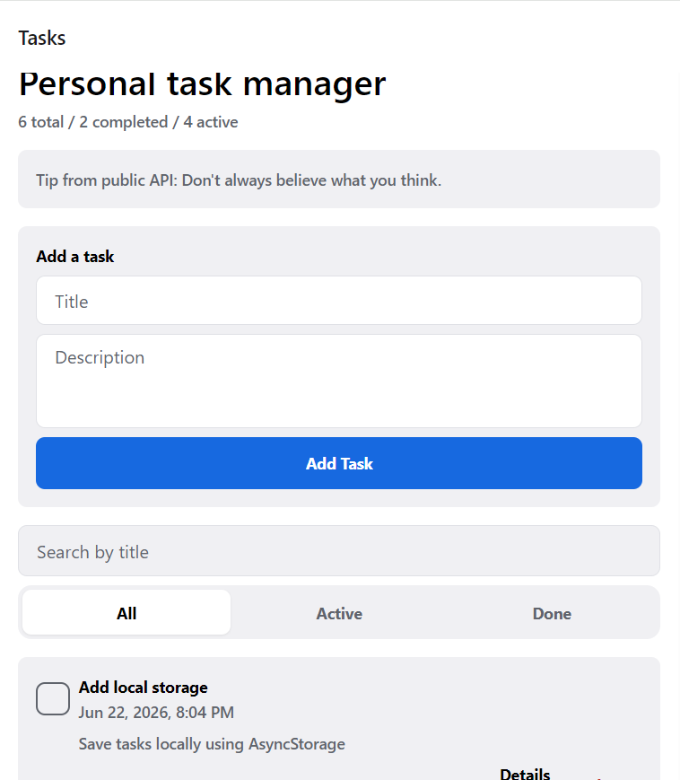
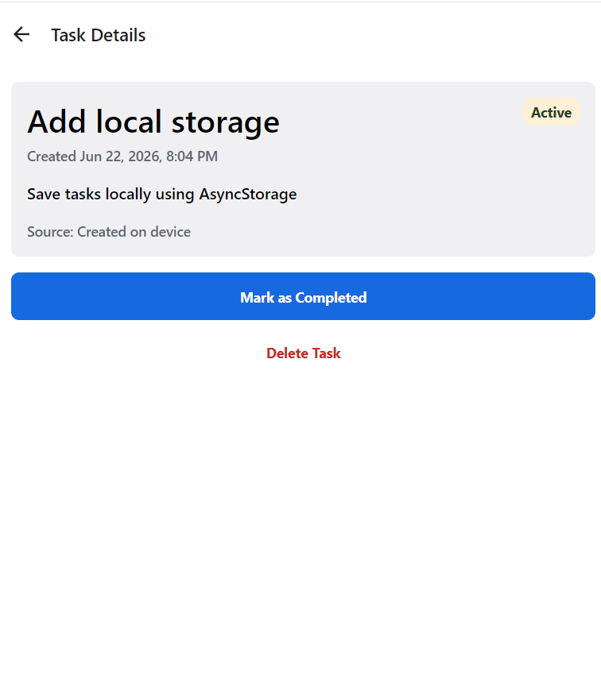
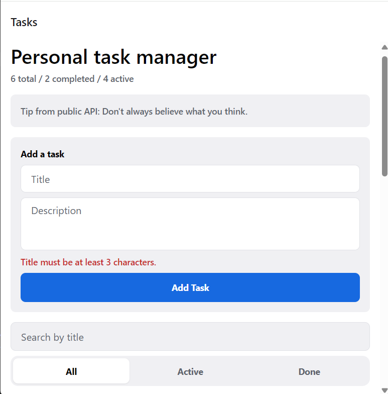
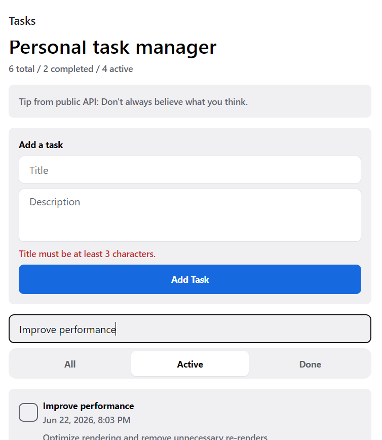
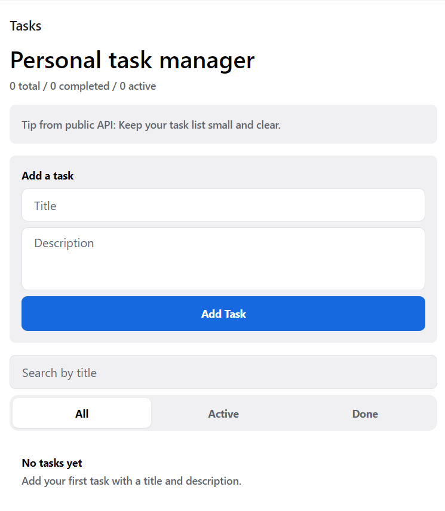

 *React Native Project*

A small Expo React Native app for managing personal tasks.

*Repository: https://github.com/arxhentakadriu/ReactNativeProject

  *What is implemented

- Task list with empty, loading, and API error states
- Add a task with title and description validation
- Mark tasks as completed or active
- Delete tasks
- Task details screen with Expo Router navigation
- Search by task title
- Filter by all, active, or completed tasks
- Local persistence — tasks you add are saved on the device/browser and stay after you close and reopen the app
- Public API integration: motivational tip fetched from [Advice Slip API](https://api.adviceslip.com/)
- Reusable task form, task card, and filter components

 *Setup

Install dependencies:

npm install

Start the development server:

npx expo start

Then open the app with Expo Go, an Android emulator, an iOS simulator, or the web option from the Expo CLI.

 *Notes

The app uses Expo SDK 56, React Native 0.85, TypeScript, functional components, and hooks. Tasks you create are saved locally with the `expo-sqlite` localStorage polyfill on native and browser `localStorage` on web, so they remain after you close and reopen the app or refresh the page. A small advice tip is fetched from a public API on the task list screen.

To regenerate screenshots locally:

bash
npx expo start --web --port 8081
node scripts/capture-screenshots.mjs

 *Screenshots

 1. Task list

Main screen with task summary, API tip, add-task form, search, status filters, and your saved task list.

 2. Task details

Detail view for a single task showing title, description, created date, and status. Users can mark the task completed/active or delete it from here.

 3. Form validation

Basic input validation prevents saving invalid tasks. The title must be at least 3 characters and the description at least 5 characters.

 4. Search By Title

Bonus features: search tasks by title and filter the list by All, Active, or Done status.

 5. Empty Space

When no tasks match the current filters, or when the list is empty after the user deletes everything, the app shows a helpful empty state instead of a blank screen.
